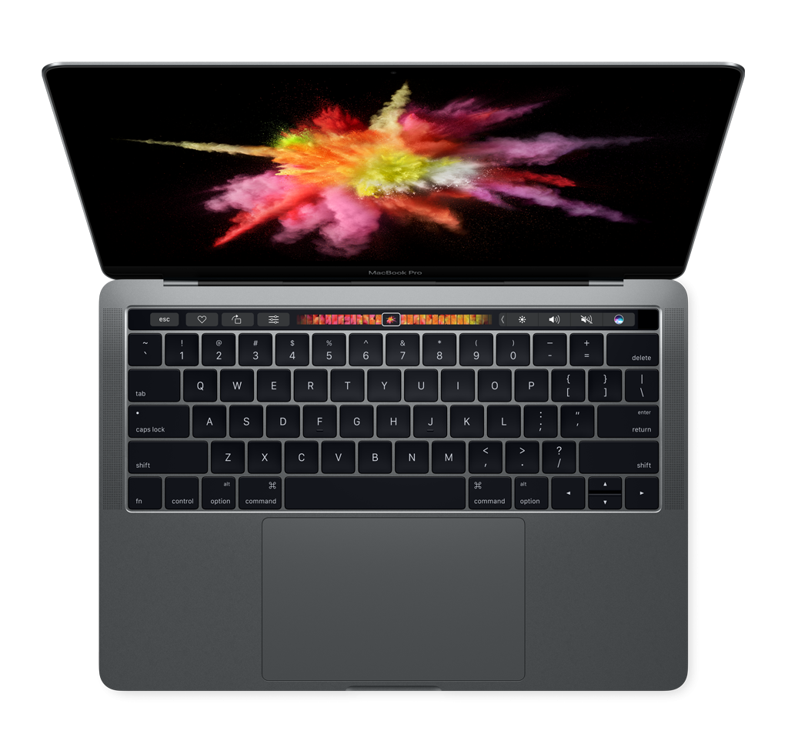
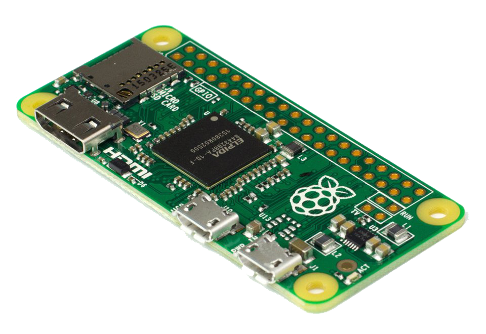

# Hacking Tools

<h1>Wifi Card:</h1>

	
The ALFA AWUS036ACH is a bang-for-your-buck wifi card. It works on both 2.4 and 5 GHz bands, and interfaces with your devices over USB-C! With a 802.11ac chipset, it is the best option as a beginner card if you don't mind spending around 70$ on it. The card comes with 2 SMA connections, so you can attach any antennas you want! Personally I have the card permanently set up in my bag connected to a Pi, read about it on the bag section of this repo.

---

<h1>Primary Computer:</h1>

	
My primary computer is the 13-inch MacBook Pro from 2019, it works for all my coding and it has been holding up amazingly since I bought it! I did cheap out on the specs though: RAM: 8gb, Processor: 1.4 GHz Quad-Core Intel Core i5, Storage: 256gb. I backup all my files on an external hard-drive, it's always a good idea to have a backup.

---

<h1>Secondary Computer:</h1>

	
The Raspberry Pi Zero 2w is my secondary computer. It's perfect for my wifi-scanning needs and has exceeded my expectations. Despite its compact size, it delivers impressive performance: RAM: 512MB, Processor: 1GHz quad-core ARM Cortex-A53. My Pi is set up in my bag with the wifi card so I can remotely connect to it an hack while on the go.

	<a href="https://www.amazon.de/-/en/ALFA-AWUS036ACH-Ultra-Range-Adapter/dp/B00VEEBOPG/ref=sr_1_1?crid=2MOW6M8IXZDVJ&keywords=ALFA+AWUS036ACH&qid=1686509261&sprefix=alfa+awus036ach%2Caps%2C185&sr=8-1">Amazon (Germany)</a>

