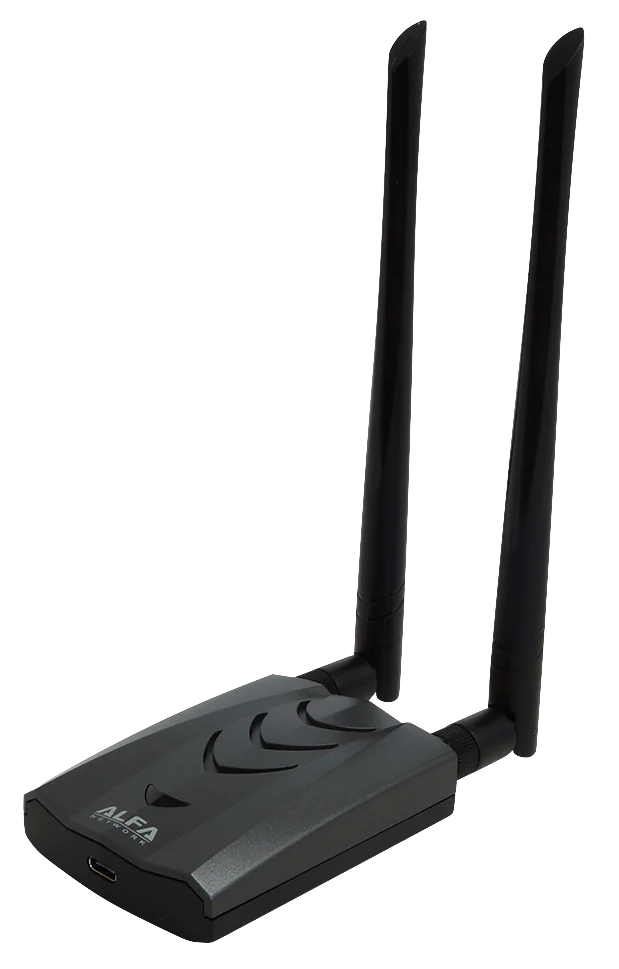

# Hacking Tools

Wifi Card:
The ALFA AWUS036ACH is a bang-for-your-buck wifi card. It works on both 2.4 and 5 GHz bands, and interfaces with your devices over USB-C! With a 802.11ac chipset, it is the best option as a beginner card if you don't mind spending around 70$ on it. The card comes with 2 SMA connections, so you can attach any antennas you want! Personally I have the card permanently set up in my bag connected to a Pi, read about it on the bag section of this repo.
